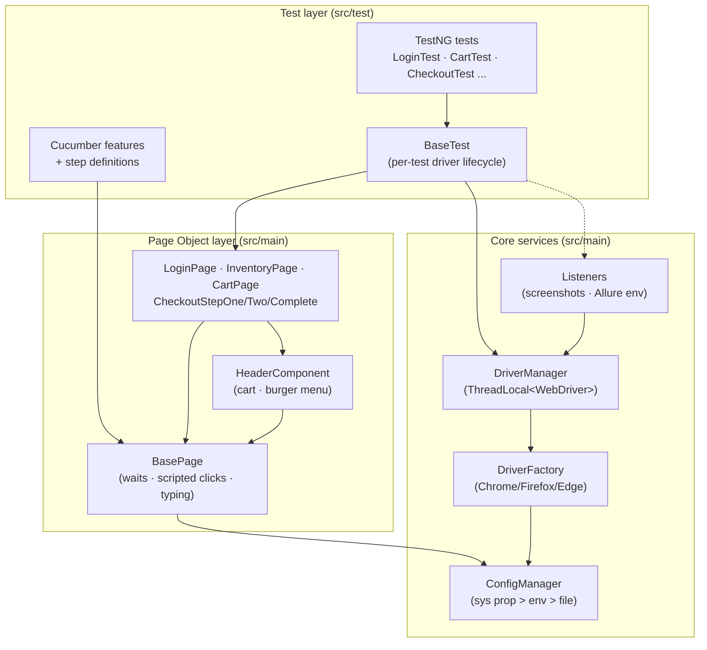
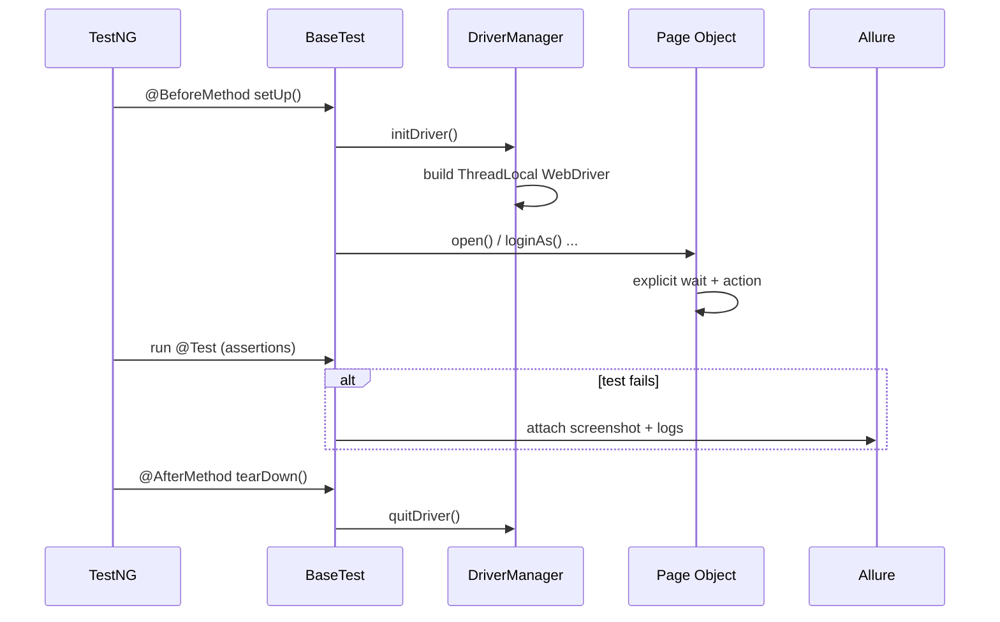

<h1 align="center">SauceDemo Selenium Java Automation Framework</h1>

<p align="center">
  A production-grade UI test automation framework for
  <a href="https://www.saucedemo.com/">SauceDemo</a>, built to the standard a
  senior automation engineer would ship: Page Object Model, thread-safe parallel-ready
  execution, explicit waits (zero flaky sleeps), rich Allure reporting published to
  GitHub Pages, and a green CI pipeline.
</p>

<p align="center">
  <a href="https://github.com/AjayAstro/selenium-java-saucedemo-framework/actions/workflows/ci.yml">
    </a>
  <a href="https://ajayastro.github.io/selenium-java-saucedemo-framework/">
    </a>
  
  
  
  
  <a href="LICENSE"></a>
</p>

<p align="center">
  📊 <b><a href="https://ajayastro.github.io/selenium-java-saucedemo-framework/">View the live Allure report</a></b>
  &nbsp;·&nbsp; one link shows what passed, what failed, screenshots, timing, environment, and execution history.
</p>

---

## Table of contents

- [Why this project](#why-this-project)
- [Tech stack](#tech-stack)
- [Architecture](#architecture)
- [Test execution flow](#test-execution-flow)
- [Project structure](#project-structure)
- [Test coverage](#test-coverage)
- [Getting started](#getting-started)
- [Running specific suites & tests](#running-specific-suites--tests)
- [Configuration](#configuration)
- [Reporting](#reporting)
- [Continuous integration](#continuous-integration)
- [Troubleshooting](#troubleshooting)
- [Roadmap](#roadmap)
- [Contributing & License](#contributing--license)

---

## Why this project

This is deliberately more than a beginner demo. It demonstrates the decisions that
matter on a real automation team:

- **Maintainable architecture** — a clean Page Object Model that separates *what* a
  test does from *how* the UI works, so locator churn never ripples into tests.
- **Reliability first** — every interaction synchronises on element/URL state; there
  is not a single `Thread.sleep`. Clicks and form input are hardened for a React SPA
  under headless Chrome.
- **Runs anywhere** — one externalised configuration drives local and CI runs across
  browsers, fully overridable from the command line.
- **Reporting a non-engineer can read** — Allure with severities, steps, screenshots,
  environment, defect categories, and execution-history trends, **published to a single
  GitHub Pages link** on every `main` build.
- **Green, gated CI** — GitHub Actions runs the whole suite headless and fails the
  pipeline on any test failure.

---

## Tech stack

| Concern              | Choice                                            |
|----------------------|---------------------------------------------------|
| Language             | Java 21                                            |
| Browser automation   | Selenium WebDriver 4                               |
| Build / dependencies | Maven                                              |
| Test runner          | TestNG (primary)                                   |
| BDD layer            | Cucumber 7 (executed through TestNG)               |
| Driver provisioning  | WebDriverManager                                   |
| Reporting            | Allure (+ GitHub Pages publishing with history)   |
| Logging              | SLF4J + Log4j2                                     |
| CI/CD                | GitHub Actions (headless Chrome)                   |
| Design pattern       | Page Object Model + reusable component objects     |

---

## Architecture

The framework is layered so each concern has exactly one home. Tests depend on Page
Objects; Page Objects depend on a synchronised `BasePage`; driver lifecycle and
configuration are isolated behind small, single-responsibility classes.



**Design principles applied**

- **Single Responsibility** — `DriverFactory` builds drivers, `DriverManager` owns
  their lifecycle, `ConfigManager` resolves configuration, Page Objects model pages.
- **DRY** — waits, clicks, and typing live once in `BasePage`; the header/cart/menu
  live once in a reusable `HeaderComponent`.
- **Open/Closed** — add a browser by extending an enum + factory switch; add a page by
  subclassing `BasePage`; nothing existing changes.
- **Thread safety** — the driver is held in a `ThreadLocal`, so the suite is safe to
  parallelise.

---

## Test execution flow



---

## Project structure

```
selenium-java-saucedemo-framework
├── pom.xml                         # Build, dependencies, Surefire + Allure plugins
├── testng.xml                      # Full regression suite (UI + BDD)
├── smoke.xml                       # Fast smoke suite
├── .github/workflows/ci.yml        # CI: test + publish Allure to GitHub Pages
│
├── src/main/java/com/saucedemo
│   ├── config/      ConfigManager.java          # Layered, overridable configuration
│   ├── driver/      DriverFactory, DriverManager, BrowserType
│   ├── pages/       BasePage + one Page Object per page + HeaderComponent
│   ├── listeners/   TestListener (screenshots), AllureEnvironmentListener
│   ├── testdata/    Products.java, Messages.java # Shared constants
│   └── utils/       ScreenshotUtils.java
│
└── src/test
    ├── java/com/saucedemo
    │   ├── base/    BaseTest.java                # Per-test driver lifecycle
    │   ├── tests/   LoginTest, InventoryTest, CartTest,
    │   │            CheckoutTest, NavigationTest, NegativeAccessTest
    │   └── bdd/     Hooks, steps/, runner/       # Cucumber layer
    └── resources
        ├── config/config.properties             # Default configuration
        ├── features/login.feature               # Gherkin scenarios
        ├── categories.json                       # Allure defect categories
        ├── META-INF/services/…ITestNGListener    # Auto-registered listeners
        ├── log4j2.xml                            # Logging configuration
        └── allure.properties
```

Page Objects live under `src/main` so they form a reusable library; the tests that
consume them live under `src/test`. Every page extends `BasePage`, which owns the
driver, the explicit `WebDriverWait`, and the synchronised interaction helpers — so no
concrete page ever duplicates wait logic or calls `Thread.sleep`.

---

## Test coverage

**40+ checks across six test classes plus a Cucumber feature.**

| Area        | Scenarios |
|-------------|-----------|
| **Login**       | standard user success · locked-out user · invalid credentials · missing username · missing password |
| **Inventory**   | page loads · product list visible · sort A→Z · sort Z→A · price low→high · price high→low |
| **Cart**        | add one item · add multiple items · remove item · badge updates · cart persists across navigation |
| **Checkout**    | full happy path · order-complete message · missing first name · missing last name · missing postal code · overview totals (subtotal = Σ items, total = subtotal + tax) |
| **Navigation**  | logout · reset app state · menu opens/closes |
| **Negative/edge** | protected page redirects unauthenticated users · locked user cannot reach inventory · checkout blocks on missing required fields |
| **BDD (Cucumber)** | login happy path · locked-out user · invalid-credentials scenario outline |

---

## Getting started

### Prerequisites
- **JDK 21+**
- **Maven 3.9+**
- **Google Chrome** (the matching driver is downloaded automatically by WebDriverManager)

### Run the full regression suite
```bash
mvn clean test
```

### Watch it run (headed)
```bash
mvn clean test -Dheadless=false
```

---

## Running specific suites & tests

```bash
# Fast smoke suite (login + add-to-cart + checkout happy paths)
mvn clean test -Dsuite=smoke.xml

# A single test class
mvn clean test -Dtest=LoginTest

# A single test method
mvn clean test -Dtest=CheckoutTest#successfulCheckout

# Only the Cucumber BDD layer
mvn clean test -Dtest=CucumberRunnerTest

# A different browser, headed
mvn clean test -Dbrowser=firefox -Dheadless=false
```

---

## Configuration

All settings live in `src/test/resources/config/config.properties` and **any value can
be overridden at runtime** with a JVM system property or environment variable of the
same name. Resolution order: **system property → environment variable → properties file**.

| Property                 | Default                     | Description                             |
|--------------------------|-----------------------------|-----------------------------------------|
| `baseUrl`                | `https://www.saucedemo.com` | Application under test                   |
| `browser`                | `chrome`                    | `chrome` \| `firefox` \| `edge`         |
| `headless`               | `true`                      | Run without a visible UI                |
| `maximize`               | `true`                      | Maximise window (ignored when headless) |
| `explicitWaitSeconds`    | `15`                        | Timeout for all explicit waits          |
| `pageLoadTimeoutSeconds` | `30`                        | Page-load timeout                       |
| `standardUser` / `password` | SauceDemo demo creds     | Test data                               |
| `browserBinary`          | *(auto)*                    | Optional explicit browser binary path   |
| `browserVersion`         | *(auto)*                    | Optionally pin the driver version       |

Example: `mvn clean test -Dbrowser=chrome -DexplicitWaitSeconds=20`

---

## Reporting

The build writes Allure results to `target/allure-results`.

```bash
# Build a static HTML report into target/site/allure-maven-plugin
mvn allure:report

# Build and open it in a browser
mvn allure:serve
```

The report is genuinely **best-in-class**:

- meaningful test names, descriptions, and an **Epic → Feature → Story** hierarchy
- **severity** labels (`@Severity`) and step-by-step breakdowns (`@Step`)
- **screenshots attached automatically on failure**
- an **Environment** widget (browser, OS, Java, base URL) generated each run
- a **Categories** widget that classifies failures (locator, timeout, assertion, …)
- **execution history & trends** once published to GitHub Pages

### 📊 Live report on GitHub Pages

Every push to `main` republishes the latest report — including failures and history —
to **<https://ajayastro.github.io/selenium-java-saucedemo-framework/>**.

> **One-time setup:** in the repository, go to **Settings → Pages** and set the source
> to **Deploy from a branch → `gh-pages` / `(root)`**. The CI workflow creates and
> updates the `gh-pages` branch automatically; after enabling Pages the link goes live
> and stays current.

---

## Continuous integration

`.github/workflows/ci.yml` runs on every push and pull request:

**`test` job**
1. Checks out the repo and sets up **JDK 21** with a **cached Maven** repository.
2. Installs stable **Google Chrome**.
3. Runs the full suite headless: `mvn -B clean test -Dheadless=true`.
4. Generates the Allure report.
5. Uploads **Allure results**, the **HTML report**, and **Surefire reports + logs**
   as downloadable artifacts.
6. **Fails the pipeline if any test fails.**

**`publish-report` job** (only on `main`, runs even when tests fail)
- Rebuilds the Allure report with prior **execution history** and deploys it to the
  `gh-pages` branch / GitHub Pages.

---

## Troubleshooting

| Symptom | Cause / fix |
|---------|-------------|
| `SessionNotCreated: This version of ChromeDriver only supports Chrome version N` | The installed Chrome and the driver disagree. WebDriverManager normally handles this; in locked-down environments pin it with `-DbrowserVersion=<major>` and/or point at a binary with `-DbrowserBinary=/path/to/chrome`. |
| Tests can't reach `saucedemo.com` | The site is blocked by a network/proxy policy. Pass the proxy with `-DchromeArgs="--proxy-server=http://host:port"`, or run where outbound HTTPS is allowed. |
| Live Allure link returns 404 | GitHub Pages hasn't been enabled yet — see the one-time setup under [Reporting](#-live-report-on-github-pages). |
| Want to debug a failure visually | Run headed and narrow scope: `mvn clean test -Dheadless=false -Dtest=CheckoutTest#successfulCheckout`. |
| Flaky-looking click/typing on a React app | Already handled — `BasePage` uses scripted clicks and a React-aware value setter; extend those helpers rather than adding sleeps. |

---

## Roadmap

- [ ] Cross-browser CI matrix (Chrome + Firefox) via a GitHub Actions matrix
- [ ] Parallel execution profile (the framework is already `ThreadLocal`-safe)
- [ ] API-assisted login to speed up non-login tests
- [ ] Dockerfile + Selenium Grid example for distributed runs
- [ ] Visual-regression checks on key pages
- [ ] Expand the Cucumber layer to cart & checkout journeys

---

## Contributing & License

Contributions are welcome — see [CONTRIBUTING.md](CONTRIBUTING.md). Released under the
[MIT License](LICENSE).

<p align="center"><sub>Built by <a href="https://github.com/AjayAstro">AjayAstro</a> · Selenium · Java 21 · TestNG · Cucumber · Allure</sub></p>
